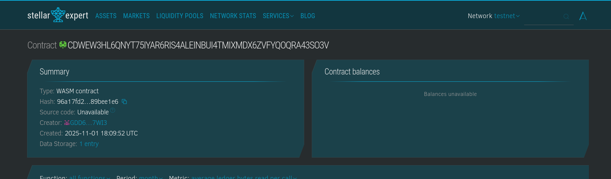

# POAP Factory Contract

The **POAP Factory** contract allows users to create and manage Proof of Attendance Protocol (POAP) events. POAPs are unique digital collectibles given to participants as proof that they attended a specific event. This contract enables event creators to set up events, issue POAPs to participants, and track claimed POAPs.

## Features

### 1. **Event Creation**

Event creators can create new POAP events by providing details such as:

- **Name**: The event's name.
- **Description**: A short description of the event.
- **Image URL**: A link to an image representing the event.
- **Max Supply**: The maximum number of POAPs that can be issued for the event.
- **Secret**: A secret code used for claiming the POAP.

Each event gets a unique ID and is stored on the blockchain for transparency and immutability.

### 2. **Claim POAP**

Participants can claim a POAP for a specific event by providing the correct secret associated with the event. Upon successful claim, the following checks are performed:

- The participant has not already claimed the POAP.
- The maximum supply of POAPs has not been reached.

Once a POAP is claimed, the participant's address is recorded, and the event’s "minted count" is updated.

### 3. **Claim Status**

The contract tracks which addresses have claimed POAPs for each event, ensuring that each participant can only claim a POAP once per event.

### 4. **Public Event Details**

Anyone can view the following details for any event:

- Event **ID**.
- **Name**, **Description**, and **Image URL**.
- **Max Supply** and **Minted Count** (how many POAPs have been distributed).

Sensitive data like the event's secret is never exposed publicly.

### 5. **Event Tracking**

Events and claims are stored on the blockchain. When a POAP is successfully claimed, a **ClaimedEvent** is emitted, allowing external applications to track POAP claims.

## Use Cases

- **Event Organizers**: Can create and manage POAP events for conferences, meetups, virtual events, and more.
- **Participants**: Can claim POAPs for attending events and keep track of their collection on the blockchain.
- **Developers**: Can integrate POAP claiming and tracking functionality into apps or websites using the contract’s public methods.

## Contract Details

- **POAP Creation**: Allows event organizers to create a new event with a unique ID, name, description, max supply, and secret.
- **POAP Claiming**: Allows participants to claim a POAP for an event, verifying their eligibility with a secret code.
- **Claim Tracking**: Keeps track of which addresses have claimed POAPs, ensuring one claim per address per event.

## How to Use

1. **Create an Event**:
   Call the `create_event` method with the required parameters (name, description, image URL, max supply, and secret).

2. **Claim a POAP**:
   To claim a POAP, provide the event ID and the secret associated with the event.

3. **Check Claim Status**:
   Use the `has_claimed` method to check if a specific address has already claimed a POAP for a given event.

4. **Get Event Details**:
   Call the `get_event` method to retrieve public details of an event.

## Security Considerations

- Each participant can claim only one POAP per event.
- The contract verifies that the correct secret is provided for claiming a POAP.
- The event creator is authenticated when creating an event to ensure only authorized users can create POAP events.

## License

This contract is released under the [MIT License](LICENSE).
